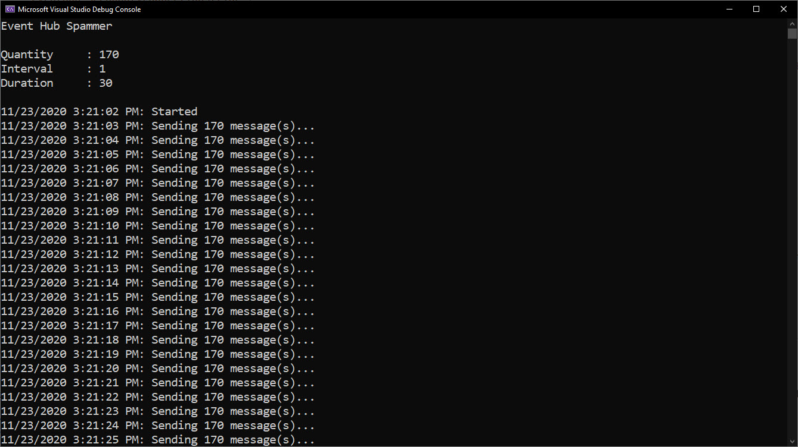

# Introduction

Console App to send messages to an Event Hub.

## Requirements

* Visual Studio Code or Visual Studio
* .NET Core 3.1 SDK

## Setup

For the Console App to run you need access to an Event Hub in Azure.

Update the `appsettings.json` file.

```json
{
  "EventHub_Name": "",
  "EventHub_PrimaryConnectionString": "",
  "EventHub_SecondaryConnectionString": ""
}
```

* **EventHub_Name** - the name of the Event Hub to send messages.
* **EventHub_PrimaryConnectionString** - the primary connection string of the Event Hub, e.g. `Endpoint=sb://EVENT_HUB_NAMESPACE.servicebus.windows.net/;SharedAccessKeyName=SAS_NAME;SharedAccessKey=SAS_KEY;`s

Note, the `EventHub_SecondaryConnectionString` is not required yet.

## Execution

To run the Consol App, open in VS Code and at the terminal prompt enter `dotnet run --quantity 10 --interval 1 --duration 10`.

This will send 10 messages every 1 second for 30 seconds.



I did try getting this to work with .NET 5.0 but ran into an isse with `CreateBatchOptions` method of the `EventHubProducerClient` client. Kept throwing an exception.
